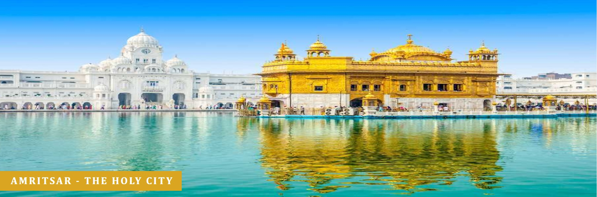
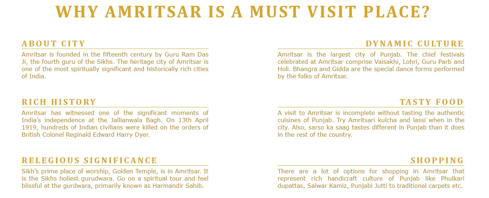

# Amritsar Tourism

Amritsar Tourism project is developed with idea of creating a website for people who are interested in Visiting Amritsar for Vacation or Explore the city and its rich culture and history. The purpose of the website is to provide some general information about Amritsar in general and highlight its top tourist attractions and an opportunity to get in touch to request further information.

# Table of contents
- Design
- Features
  - Languages Used
  - Navigation
  - Home Page Hero Image
  - Home Page
  - Footer
  - Buddhism and Meditation
  - Get in Touch
- Testing
- Validator Testing
- Unfixed Bugs
- Libraries & Programs Used
- Deployment
- Credits
- Content
- Media

# Design

### Text & Background color

Amritsar City is also called as Golden City. Hence, color them of my website is to based upon Gold and White colors contrast. We have choosen background color for header and footer 'antiquewhite' to provide some contrast from the main sections. All heading have Goldern (#DAA520) text color. Main website background is of white color with text color of 'darkgoldenrod'.

# Features

## Common Features

### Languages Used

  - HTML5
  - CSS3

### Navigation

In my website 3 navigation buttons (one per page) have been provided in the top right section of the header to allow for the user to easily locate and use. The location of the navigation buttons can change with small screens. The navigation button are located under the logo on small screens. This section is same on all pages of website.

### Footer

The footer section contains the links to social media sites (Facebook, Twitter, YouTube and Instagram). This section is same on all pages of website.

## Home Page

### Main Image

A Main Image is used on the Home Page below header. The text over the Hero Image, 'Amritsar - The Holy City', has been added to bottom-left part of image and has been included to improve the design. 'Amritsar - The Holy City' is tagline in context of people of Sikh relegion. As Amritsar has one of the prime worship place for Sikh's called as Golden Temple.

### Home Page

This page provides the information a user require to know some basic facts about Amritsar and its rich history and culture. Each of the section desribe a different fact about city a user should know to make informative decision. This have been broken into sections to make it easy to read. This section has been kept simple and to the point.

- **About City** : This section contains basic information about the Amritsar city like who and when this city was founded.
- **Rich History** : This section desribe about rish historical aspect of the city.
- **Relegious Significance** : This section inform the use about the relegiuos relevance of the city.
- **Dynamic Culture** : This section explains about the rich punjabi culture this city has to offer.
- **Tasty Food** : This section show all the different varities of deleciuos food a use can experience on his visit.
- **Shopping** : This section has information on all kind of shopping options available in the city.

### Attractions Page

The attractions page provides images of top attactions in amritsar, some of which we have also talked about on Home Page. I thought it was important to let people have some idea about how these places looks and feel to make an informed decision as well as attract them by showing beauty of the city. Screenshots of these sections have been provided below.

### Contact Us Page

This page allows provide an opportunity to the user to get in contact with the group if they have any further queries about visiting/exploring Amritsar city. I've also used the Google Map API to link the Amritsar city map. It can help user to locate palces of city without leaving the website.

### Confirmation Page

The Confirmation page has been created to Congratulate the use to reach us for further information. Also, it provides the confirmation that there information has been submitted. 

# Testing
# Validator Testing
# Unfixed Bugs
# Libraries & Programs Used

- **Github**: Store Repository
- **Codeanywhere**: Create the html and css files
- **Google Chrome Dev Tools**: To aid the initial styling for media queries and testing at various screen sizes
- **Microsoft Edge**: Site testing on an alternative browser
- **Font Awesome**: Social media icons
- **Snipping Tool**: Screenshots of the final project for the README file

# Deployment

The site is deployed to GitHub pages. The steps to deploy are as follows:

- In the GitHub repository, select the amritsar-tourism project from left pane 'Top Repositories' section
- Click on Settings tab in navigation menu.
- Select the 'Pages' tab in the 'Code and Automation' section.
- From the Build and deployment section, go to source and select 'Deploy from a branch' in drop-down menu.
- Next select the 'Main' branch under Branch drow-down menu.
- Once the 'Main' branch has been selected, the page will be automatically refreshed with a detailed ribbon display to indicate the successful deployment.
- The live link for the site can be found here - [/sugandhi13.github.io/amritsar-tourism] (<https://sugandhi13.github.io/amritsar-tourism/>)

# Credits

I have really enjoyed the Code Institute course up till now, and I am looking forward to the next units of the course. I wanted to thank the Slack Community for their support learning the content and my Mentor Martina for her guidance with this project and assurances that creating a website is not as scary as I initially thought.

As a starting point I looked at the Coders Coffee and Love Running projects.

From the Love Running Project, I took inspiration for the header, hero banner, footer and form.
From the Coders Coffee Project, I took inspiration from in my 'What we do?' section.

# Content
# Media
