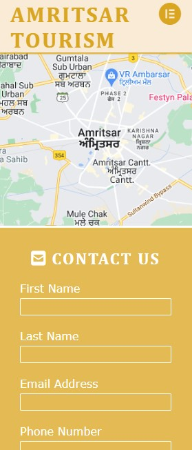

# Amritsar Tourism

Amritsar Tourism project is developed with idea of creating a website for people who are interested in Visiting Amritsar for Vacation or Explore the city 
and its rich culture and history. The purpose of the website is to provide some general information about Amritsar in general and highlight its top tourist 
attractions and an opportunity to get in touch to request further information.

To access live website [click here](https://sugandhi13.github.io/amritsar-tourism/).

# Re-submission Comment

I'm resubmitting this project as the media queries didn't behaved as expected during the evalution while checked by the examinar. 
The major problem described by the reviewer that the site is not responsive across tested devices (desktop, mobile, and tablet). 
On smaller devices the footer overlaps other content, and the text on the landing page is very hard to read across multiple columns. 
Therefore the responsiveness severely hamper usability of the website. 

Now I've learn't a bit more and have a better understanding than before when I initially started working on this project. 
I've put my best efforts and used new methods and coding techniques I've learned in last few months in code insititute.

I would like to give additional credits to new Love Running Project added by code institute create by Jo Heyndels. 
This new course helped me to understand how to handle media query in a better way by focusing on mobile first development. 
I have also learned a better way to use fontawesome website to create icons (social media or other types) from text 
that blends well instead of images in web development. Lastly, I've understood now how to compress image without loosing its quality 
much that helps to load images faster when web page loads as well as looks better without much distortions in the image.

After redevelopment, I've performed all the testing on different browsers, laptop, tablet and mobiles etc. The results looks good to me 
and meets my expectation. The footers are no more going over the text on small screens and navigation menu also handled in a better 
way on big and small screens.

I've created an archive folder and kept the all old files (html and css) in that folder.

### Am I Responsive

# Table of contents

- [Amritsar Tourism](#amritsar-tourism)
- [Re-submission Comment](#re-submission-comment)
    - [Am I Responsive](#am-i-responsive)
- [Table of contents](#table-of-contents)
- [Design](#design)
    - [Text \& Background color](#text--background-color)
- [Features](#features)
  - [Common Features](#common-features)
    - [Languages Used](#languages-used)
    - [Favicon](#favicon)
    - [Navigation](#navigation)
      - [Desktop Version](#desktop-version)
      - [Mobile Version](#mobile-version)
    - [Footer](#footer)
  - [Home Page](#home-page)
    - [Hero Image](#hero-image)
    - [Home Page](#home-page-1)
      - [Desktop Version](#desktop-version-1)
      - [Mobile Version](#mobile-version-1)
    - [Attractions Page](#attractions-page)
      - [Desktop Version](#desktop-version-2)
      - [Mobile Version](#mobile-version-2)
    - [Contact Us Page](#contact-us-page)
      - [Desktop Version](#desktop-version-3)
      - [Mobile Version](#mobile-version-3)
    - [Confirmation Page](#confirmation-page)
      - [Desktop Version](#desktop-version-4)
      - [Mobile Version](#mobile-version-4)
    - [404 Page](#404-page)
- [Testing](#testing)
    - [UPDATE](#update)
    - [Manual Testing](#manual-testing)
      - [Email Validation](#email-validation)
      - [Phone No Validation](#phone-no-validation)
- [Validator Testing](#validator-testing)
    - [HTML](#html)
      - [Index Page Validation](#index-page-validation)
      - [Attractions Page Validation](#attractions-page-validation)
      - [Contact-Us Page Validation](#contact-us-page-validation)
      - [Confirmation Page Validation](#confirmation-page-validation)
    - [CSS](#css)
    - [Lighthouse](#lighthouse)
      - [Desktop Version](#desktop-version-5)
      - [Mobile Version](#mobile-version-5)
- [Unfixed Bugs](#unfixed-bugs)
    - [UPDATE](#update-1)
- [Libraries \& Programs Used](#libraries--programs-used)
- [Deployment](#deployment)
- [Credits](#credits)
- [Content](#content)
- [Media](#media)
    - [Images](#images)
    - [Other Websites](#other-websites)

# Design

### Text & Background color

Amritsar City is also called as Golden City. Hence, color them of my website is to based upon Gold and White colors contrast. 
We have choosen background color for header and footer 'antiquewhite' to provide some contrast from the main sections. 
All headings have Golden (#DAA520) text color. Main website background is of white color with text color of Golden (#DAA520).
Lastly we have used 'aquamarine' color to highlight the input box the user is in on Contact us form.

# Features

## Common Features

### Languages Used

- HTML5
- CSS3

### Favicon

Favicon is used in the website title to give the website more professional look and feel. 

### Navigation

In my website 3 navigation buttons (one per page) have been provided in the top right section of the header to allow for the 
user to easily locate and use. The location of the navigation buttons can change with small (mobile) screens. The navigation menu is 
located under a button near logo on small screens and populates when the user clicks on the button. 
This section is same on all pages of website.

#### Desktop Version

#### Mobile Version

### Footer

The footer section contains the links to social media sites (Facebook, Twitter, YouTube and Instagram). This section is same on all pages of website.
The space between social media icons change with size of the screen.

## Home Page

### Hero Image

A Hero Image is used on the Home Page below header. The text over the Hero Image, 'Amritsar - The Holy City', has been added to 
bottom-left part of image and has been included to improve the design. 'Amritsar - The Holy City' is tagline in context of people 
of Sikh relegion. As Amritsar has one of the prime worship place for Sikh's called as Golden Temple.

### Home Page

This page provides the information a user require to know some basic facts about Amritsar and its rich history and culture. 
Each of the section desribe a different fact about city a user should know to make informative decision. This have been broken 
into sections to make it easy to read. This section has been kept simple and to the point.

- **About City** : This section contains basic information about the Amritsar city like who and when this city was founded.
- **Rich History** : This section desribe about rish historical aspect of the city.
- **Relegious Significance** : This section inform the use about the relegiuos relevance of the city.
- **Dynamic Culture** : This section explains about the rich punjabi culture this city has to offer.
- **Tasty Food** : This section show all the different varities of deleciuos food a use can experience on his visit.
- **Shopping** : This section has information on all kind of shopping options available in the city.

#### Desktop Version

#### Mobile Version

 

### Attractions Page

The attractions page provides images of top attactions in amritsar, some of which we have also talked about on Home Page. 
I thought it was important to let people have some idea about how these places looks and feel to make an informed decision 
as well as attract them by showing beauty of the city. Screenshots of these sections have been provided below.

#### Desktop Version

#### Mobile Version

 

### Contact Us Page

This page allows provide an opportunity to the user to get in contact with the group if they have any further queries about 
visiting/exploring Amritsar city. I've also used the Google Map API to link the Amritsar city map. It can help user to locate 
palces of city without leaving the website.

#### Desktop Version

#### Mobile Version

 

### Confirmation Page

The Confirmation page has been created to Congratulate the use to reach us for further information. Also, it provides the confirmation 
that there information has been submitted.

#### Desktop Version

#### Mobile Version

### 404 Page

The 404 (Error) page has been created for defensive design. It notifies the user with the following message: 
"Oops! Nothing to see here! Go back to the homepage". The word "homepage" is clickable and redirects 
the user to the landing (index.html) page of the website.

# Testing

The site has been tested on a variety of mobile devices as well as different web browsers (Chrome, Firefox, Safari) and all links, 
images and the contact form functioned as it should. All input fields of the contact form function correctly, and require the requested 
input fields before submitting.

I personally tested the site extensively with Google Chrome dev tools to ensure the site works responsively not only on mobile devices 
but also on medium to larger screens.

One of the biggest problems I encountered from the beginning handling css on different webpages. Then I took help from Love running 
project as well as w3school and stackoverflow websites (mentioned in credits as well).

Another issue I faced is how to handle cover-text on main image when switching from desktop browsers to mobile browsers as well as 
alignments of navigation menu and footer elements. I've tried my best to fix these issues.

Henceforth, applying media queries has been the biggest challenge during this project.

Some improvements are done on different HTML pages after testing them on W3C Validator.

### UPDATE

I'm resubmitting this project as the media queries didn't behaved as expected during the evalution by the examinar. 
Now I've learn't a bit more and have a bit better understanding than before when I initially started working on this project. 
I've put my best efforts and used new methods and coding techniques I've learned in last few months in code insititute.

I would like to give additional credits to new Love Running Project added by code institute create by Jo Heyndels. 
This new course helped me to understand how to handle media query in a better way by focusing on mobile first development. 
I have also learned a better way to use fontawesome website to create icons (social media or other types) from text 
that blends well instead of images in web development. Lastly, I've understood now how to compress image without loosing its quality 
much that helps to load images faster when web page loads as well as looks better without much distortions in the image.

After redevelopment, I've performed all the testing on different browsers, laptop, tablet and mobiles etc. The results looks good to me
and meets my expectation. The footers are no more going over the text on small screens and navigation menu also handled in a better
way on big and small screens.

### Manual Testing

| Test Case | Expected Results | Results |
| ----------- | ----------- | ----------- |
| Open Website using the link provided | Amritsar Toursim website homepage (index.html) should open without any overlapping on text, images, navigation menu or social media icons. Also the layout should change and adjust itself when changing the screensize from small to big or vice-versa. | As Expected |
| Click on the attractions link from navigation bar | Attractions page should open up without any overlapping on text, images, navigation menu or social media icons and all images should be well presented without any distortion or streching. Also the layout should change and adjust itself when changing the screensize from small to big or vice-versa. | As Expected |
| Click on the contact-us link from navigation bar | Contact-Us page should open up without any overlapping on text, map, form, navigation menu or social media icons. Also the layout should change and adjust itself when changing the screensize from small to big or vice-versa. | As Expected |
| Enter wrong email address in contact-us form | An error message should display if the email id doesn't provided in the required email format | As Expected |
| Enter Text or leave blank phone number in contact-us form | An error message should display if the user try to leave it blank and it should not allow to enter alphbets | As Expected |
| Leave any field of contact us form blank | All fields are mandatory to fill, an error message should populate if any field of the form is left blank. | As Expected |
| Click on Submit button on Contact us form after filling required details | A confirmation page should open up and congratulate the user that the information provided has been submitted successfully | As Expected |
| Error (404) Page  | When a user enter an incorrect address of the website. Page 404.html should publish and inform user that no such webpage exsit and contains link to route user to home page | As Expected |

#### Email Validation

#### Phone No Validation

# Validator Testing

### HTML

No errors were returned when passing through the official W3C validator.

#### Index Page Validation

#### Attractions Page Validation

#### Contact-Us Page Validation

#### Confirmation Page Validation

### CSS

No errors were found when passing through the official W3C CSS (Jigsaw) validator.

### Lighthouse

The page achieved great performance on mobile and desktop.

#### Desktop Version
  
  

#### Mobile Version
  
  

# Unfixed Bugs

I've struggled with Media queries and how to handle website on different devices. This website currently looks great on desktop 
borwsers but have issues with alignments on other media devices.

I will try to improve further on this in coming days and considering it as a challenge to handle.

### UPDATE

I'm resubmitting this project due to the above unfixed bugs. Now I've learn't a bit more and have a bit better understanding than before when 
I initially started working on this project. I've put my best efforts and used new methods and coding techniques I've learned in last few months
in code insititute.

After redevelopment I faced following warning on index.html and attractions.html page. The warning states to avoide using h1 tag multiple times 
on a webpage as its only for top-level headings. I've fixed this by using h2 or h3 tags and managing the font-size from css to make my text look
as I expected it should be without having this waring in W3C validator. 

Hence, I don't have any known bug as per my understanding left in this project.

# Libraries & Programs Used

- **Github**: Store Repository
- **Codeanywhere**: Create the html and css files
- **Google Chrome Dev Tools**: To aid the initial styling for media queries and testing at various screen sizes
- **Microsoft Edge**: Site testing on an alternative browser
- **Snipping Tool**: To take screenshot for images of various results
- **Am I Responsive**: To ensure website looks good on different devices
- **W3C Validator**: To validate HMTL pages
- **W3C CSS Validator**: To validte CSS
- **Favicon**: To create the favicon for title of the website
- **Fontawesome**: To create social media and other icons used for various section on each page of the website
- **Tinypng**: To compress the images that helps to load faster on the web
- **Google Map**: To create Google Map API and used on contact us page

# Deployment

The site is deployed to GitHub pages. The steps to deploy are as follows:

- In the GitHub repository, select the amritsar-tourism project from left pane 'Top Repositories' section
- Click on Settings tab in navigation menu.
- Select the 'Pages' tab in the 'Code and Automation' section.
- From the Build and deployment section, go to source and select 'Deploy from a branch' in drop-down menu.
- Next select the 'Main' branch under Branch drow-down menu.
- Once the 'Main' branch has been selected, the page will be automatically refreshed with a detailed ribbon display to indicate the successful deployment.
- The live link for the site can be found here - [/sugandhi13.github.io/amritsar-tourism](https://sugandhi13.github.io/amritsar-tourism/)

# Credits

I have really enjoyed the Code Institute course up till now, and I am looking forward to the next units of the course. 
I wanted to thank the Slack Community for their support learning the content and my Mentor Martina for her guidance with 
this project and assurances that creating a website is not as scary as I initially thought.

As a starting point I looked at the Coders Coffee and Love Running projects.

- From the Coders Coffee Project, I got understanding of how to use Codeanywhere and GitHub to develop website.
- From the Love Running Project, I took inspiration for the header, hero banner, footer and form.
- Wikipedia and Punjab Tourism websites, I have referred these website to create content on my website.

I would like to give additional credits to new Love Running Project added by code institute create by Jo Heyndels. This new course helped me to understand
how to handle media query in a better way by focusing on mobile first development. I have also learned a better way to use fontawesome website to create 
icons (social media or other types) from text that blends well instead of images in web development.

# Content

Following websites have been referred to generate the content on Home page along with some sentences included/modified 
by me to best fit in websites context.

- [punjabtourism.punjab.gov.in](https://punjabtourism.punjab.gov.in/destination-amritsar.php)
- [wikipedia.org](https://en.wikipedia.org/wiki/Amritsar)
- [indiahotels.com](http://www.indiahotels.com/amritsar/amritsar-culture.html)

# Media

### Images

Various websites are referred to collect images used in this website. Original source links can be found below.

- Hero Image - [unsplash.com](https://unsplash.com/s/photos/golden-temple)
- Wagha Image - [unsplash.com](https://unsplash.com/@gabography)
- Maharaja Ranjit Singh Image - [unsplash.com](https://unsplash.com/photos/bdWNnJP8_oA)
- Gobindgarh Fort Image - [fortgobindgarh.com](https://www.fortgobindgarh.com/gallery.php)
- Ram Tirath Image - [ffo.gov.in](https://ffo.gov.in/locations/location-information/69)
- Sadda Pind Image - [googleusercontent.com](https://lh5.googleusercontent.com/p/AF1QipP6i60UYzdaQdFCtZVGE9TcA-7UzIQUYu8YjXRw=w600-h321-p-k-no)
- Durgiana Temple Image - [googleusercontent.com](https://lh3.googleusercontent.com/proxy/kcFhudzDfjqLkTJbn-SGOG-50LFYbPNc3HZoYVAjLY442AyfMRXRlicCZyBHK2mlF8K9zPG-JafBTyOhTu4HWQjvv-cImvv_xTvNkBZXCQcbxGZ-grX7Vm-hq5WHR-n5a5ruIT740JhPa6k2sB_u2gobanyMOg=s680-w680-h510)
- Jallianwala Bagh Image - [stockvault.net](https://www.stockvault.net/free-photos/Jallianwala-Bagh/)
- Sikha boy and Fields Image - [pixabay.com](https://pixabay.com/photos/sikh-religion-sikhism-punjab-holy-658521/)
- Confirmation Page Image - [historypak.com](https://historypak.com/punjabi-culture-2/)

### Other Websites

- Google Map API - [maps.google.com](https://goo.gl/maps/g1H9qGUC1iNNKUoq8)
- Favicon - [favicon.io](https://favicon.io/)
- Fontawesome - [fontawesome.com](https://fontawesome.com/)
- Tinypng - [tinypng.com](https://tinypng.com/)
- Unsplash - [unsplash.com](https://unsplash.com/)
